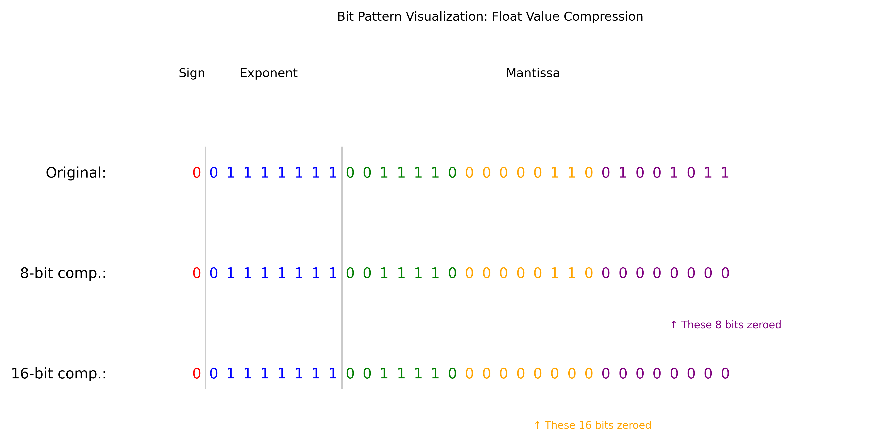
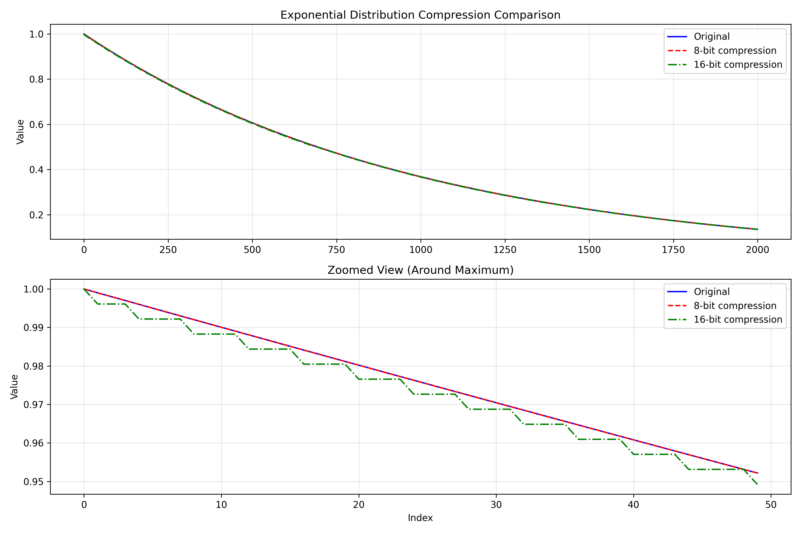
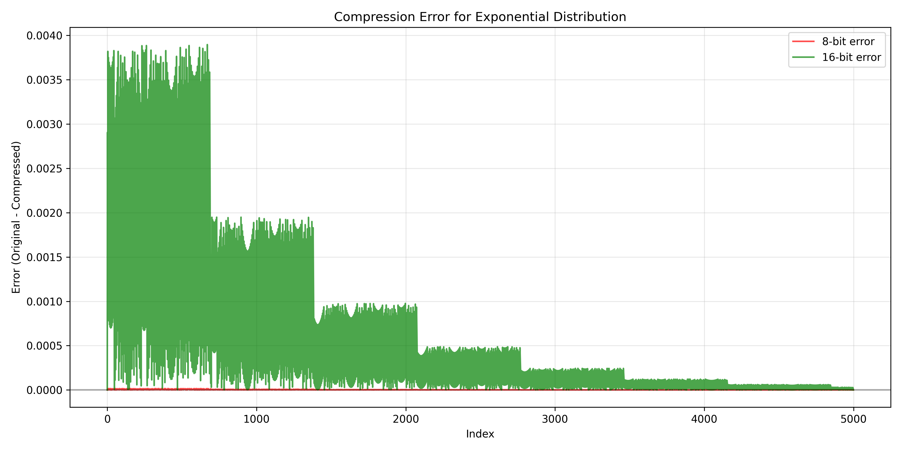
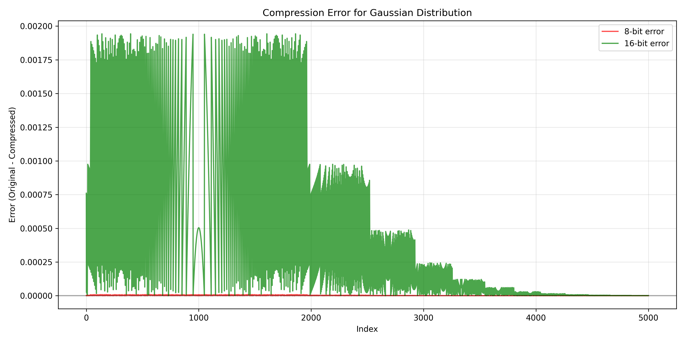
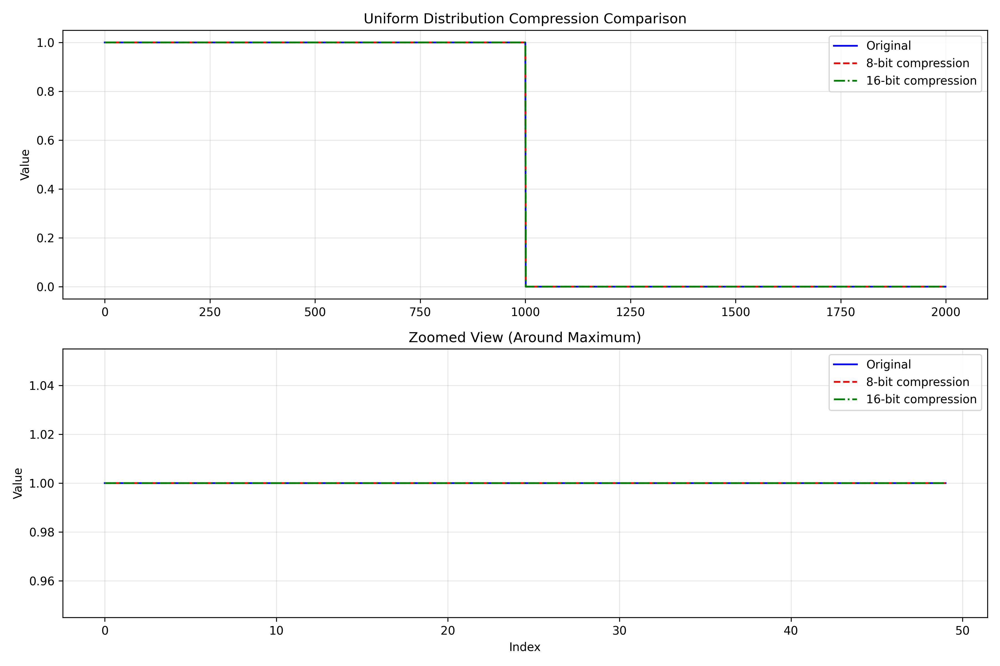
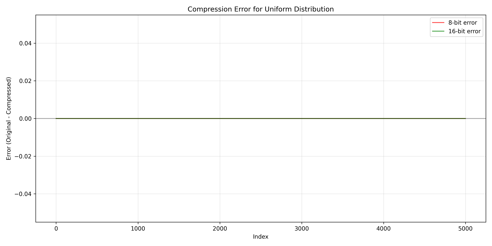
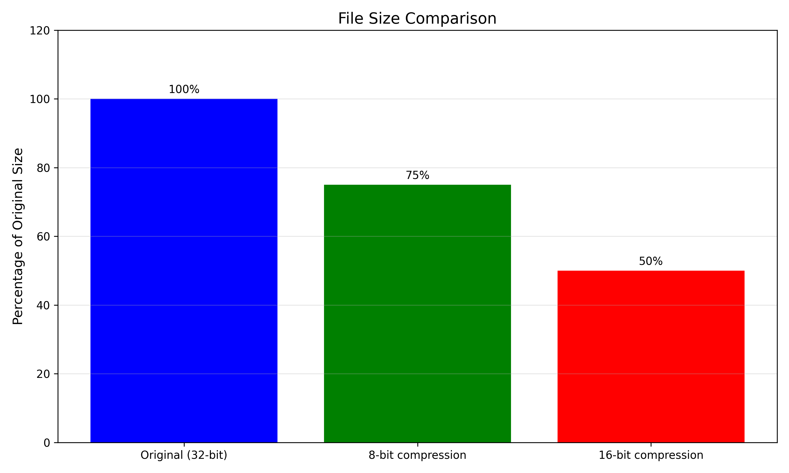

# Save the final README.md content to a file for download

readme_content = """# Lossy Floating-Point Compression: Warm-Up Exercise

This repository demonstrates a **lossy floating-point compression** technique by zeroing out a configurable number of least significant bits in the mantissa. We use three different distributions—**Gaussian**, **Uniform**, and **Exponential**—to generate test data and evaluate the compression’s effect on file sizes and statistical properties.

---

## 📁 Project Structure

- **`test.cpp`**  
  - Generates floating-point datasets from three distributions.  
  - Applies lossy compression by masking 8 or 16 mantissa bits.  
  - Saves full-precision and compressed versions to binary files.  
  - Computes statistics and error metrics.  
  - Exports data to CSV for visualization.  
  - Calls Python to generate plots.

- **`plot.py`**  
  - Reads exported CSVs.  
  - Plots distribution comparisons, compression errors, and bit-level visuals.  
  - Generates a file size comparison bar chart.

---

## ⚙️ How It Works

### 📊 Data Generation

- **Gaussian**: Normal distribution with mean = variance, starting from 0.5  
- **Uniform**: Flat distribution from `c` to `c+1`, where `c ∈ [0, 5]`  
- **Exponential**: \( f(x) = \lambda e^{-\lambda x} \), with \( \lambda ≥ 0.5 \)

### 💾 Compression Technique

- Floating-point numbers are 32-bit (1 sign bit, 8 exponent bits, 23 mantissa bits).  
- `compressFloat(f, n)` zeroes out `n` least significant mantissa bits.  
- Implemented for **8-bit** and **16-bit** lossy compression.

### 📉 Evaluation Metrics

- File size reduction  
- Mean, variance, and standard deviation  
- Mean Squared Error (MSE)  
- Max absolute error  
- Visual comparison (zoomed + full view)

---

## 🛠️ How to Build and Run

1. **Compile the C++ code:**
   ```bash
   g++ test.cpp -o test -O2
   ```
2. **Run the executable**
   ```bash
   ./test
   ```

3. **Review the console output for file sizes and error metrics**

4. **Check the output `.png` files for visual results.**

### 📷 Results & Interpretation

#### ✅ Bit Pattern Visualization
- Visualizes how mantissa bits are truncated
- Shows preserved sign/exponent and masked bits (8 or 16)
- Demonstrates which parts of the floating-point representation are affected by compression

#### 🧪 Distribution Comparison Plots
- **Gaussian**: 
  - 16-bit compression preserves the overall shape well
  - 8-bit compression shows almost no visible difference from original
  - Only minimal flattening of peak values in the most aggressive compression

- **Exponential**: 
  - Both compression levels preserve the exponential decay curve
  - 16-bit compression shows small deviations mainly in the steepest parts
  - 8-bit compression results are nearly indistinguishable from original

- **Uniform**: 
  - No visible difference across compression levels
  - The rectangular shape is perfectly maintained
  - Demonstrates robustness for simple distributions

#### 📈 Compression Error Plots
- **Gaussian & Exponential**:
  - 16-bit compression error is measurable but controlled
  - 8-bit compression error is nearly imperceptible
  - Errors are not randomly distributed but show structure related to value magnitude

- **Uniform**:
  - Minimal error for both compression levels
  - Compression doesn't significantly affect the binary representation of constant values
  - Demonstrates efficiency for piecewise constant functions

#### 📦 File Size Comparison

| Format | Size (% of original) |
|--------|----------------------|
| Original (32-bit) | 100% |
| 8-bit Compressed | 75% |
| 16-bit Compressed | 50% |

#### 🧠 Conclusion

This project demonstrates that bit-level mantissa truncation can:

- Substantially reduce storage requirements (up to 50%)
- Preserve essential statistical properties of distributions
- Introduce minimal and predictable errors
- Be applied effectively across different distribution types

#### 📌 Recommendations

- Use 8-bit compression where better accuracy is needed but storage is still a concern
- Use 16-bit compression for general storage-constrained applications and visualization
- Use full precision for sensitive scientific computations or high-accuracy requirements
- Consider the specific distribution characteristics when selecting compression levels

#### 🖼️ Images








